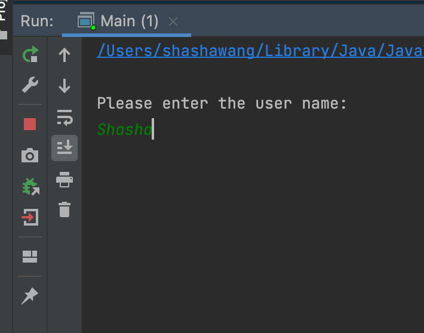

# Java-ArtilleryGame-TerminalVersion
## Step one : input your name

## You will get cannon and target positions randomly,follow the game instruction to set angle and power to shoot

## You will see the red arrow's trajectory to see if the target is been shot

## If the bullet hit the target, the target will disappear

## You can enter 'e' to exit the game

